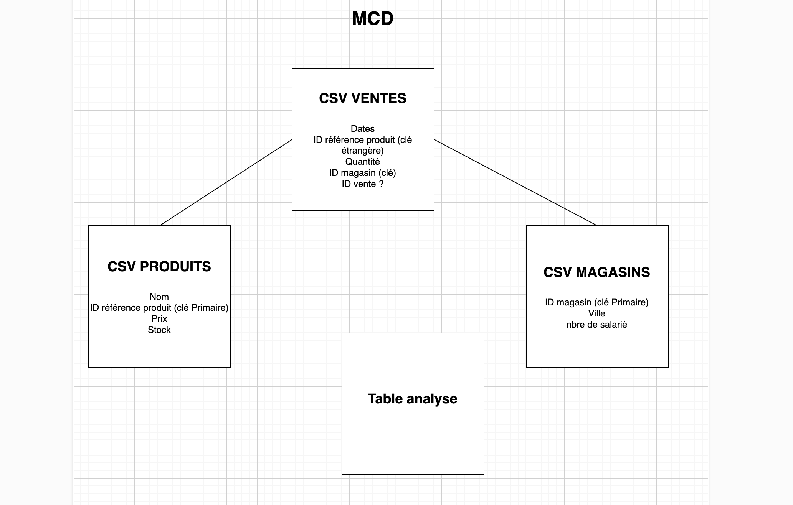

# Analyse des ventes d'une PME

Projet réalisé dans le cadre de ma formation Data Engineer chez Simplon. L'objectif était de créer un système d'analyse de données de ventes en utilisant Docker et Python.

## Le projet

J'ai développé un pipeline de données qui automatise l'analyse des ventes d'une entreprise ayant plusieurs magasins en France. Le système importe des données CSV, les stocke dans une base SQLite et calcule automatiquement des indicateurs clés.

### Architecture

Le projet utilise Docker avec deux conteneurs :
- Un conteneur Python qui exécute les scripts d'analyse
- Un conteneur SQLite pour la base de données

Les deux communiquent via un volume partagé, ce qui permet de séparer la logique métier du stockage des données.


## Installation et lancement

Prérequis : Docker et Docker Compose installés

```bash
# Cloner le projet
git clone https://github.com/votre-username/analyse-ventes-pme.git
cd analyse-ventes-pme

# Lancer l'application
docker-compose up --build
```

C'est tout ! Le pipeline s'exécute automatiquement et génère les analyses dans la base de données.

## Structure de la base de données



La base contient 4 tables :
- `produits` : catalogue des produits
- `magasins` : informations sur les points de vente
- `ventes` : transactions
- `analyses` : résultats des KPI calculés

## Analyses réalisées

Le système calcule trois indicateurs principaux :

**Chiffre d'affaires total** : 5 268,78 €

**Ventes par produit** :
- Produit E : 35 unités
- Produit B : 27 unités  
- Produit A : 24 unités

**Ventes par ville** :
- Marseille : 27 ventes
- Lyon : 21 ventes
- Paris : 20 ventes


## Technologies utilisées

- Python 3.11 (Pandas, Requests)
- Docker et Docker Compose
- SQLite
- SQL pour les requêtes d'analyse

## Ce que j'ai appris

Ce projet m'a permis de mettre en pratique :
- La conteneurisation d'applications avec Docker
- La conception d'une architecture microservices simple
- La modélisation de bases de données relationnelles
- L'automatisation de pipelines ETL
- La gestion des doublons lors de l'import de données

## Contact

Halim MOULAY  
halim.moulay@gmail.com  
[GitHub](https://github.com/highkuu)
